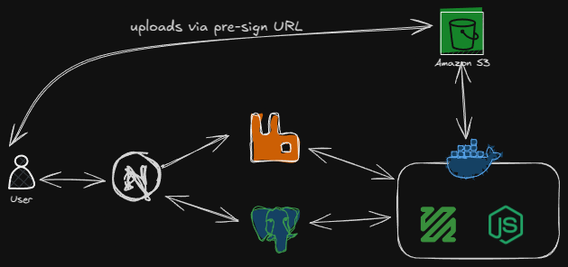

# VibeTube Project Setup Guide

This document outlines the steps required to set up and run the VibeTube project locally.

## Project Architecture

The following diagram illustrates the project's architecture:



The VibeTube project consists of two main components: the Next.js webserver and the HLS transcoder.

## Prerequisites

* **Git:** Ensure Git is installed on your system.
* **Node.js and npm:** Node.js and npm are required for dependency management and running scripts.
* **PostgreSQL:** A running instance of PostgreSQL is required.
* **Docker (Optional):** Docker is required if you intend to build the Docker image.

## Setup Instructions

### 1. Clone the Repositories

1.  **Clone the Next.js Webserver:**

    ```bash
    git clone https://github.com/sidharthtripathi/youtube-nextjs-webserver](https://github.com/sidharthtripathi/youtube-nextjs-webserver
    ```

2.  **Clone the HLS Transcoder:**

    ```bash
    git clone https://github.com/sidharthtripathi/hls-yt
    ```

### 2. Setup the HLS Transcoder

* Follow the setup instructions provided in the HLS Transcoder repository's README: [https://github.com/sidharthtripathi/hls-yt](https://github.com/sidharthtripathi/hls-yt)

### 3. Setup the Next.js Webserver

1.  **Navigate to the Webserver Directory:**

    ```bash
    cd youtube-nextjs-webserver
    ```

2.  **Configure Environment Variables:**

    * Copy the `.env.example` file to `.env`.
    * Modify the `.env` file with the appropriate values for your environment, including database connection details.

3.  **Install Dependencies:**

    ```bash
    npm install
    ```

4.  **Initialize the PostgreSQL Database:**

    * Ensure your PostgreSQL database is running.
    * Run the database initialization script:

        ```bash
        npm run db:init
        ```

5.  **Start the Development Server:**

    ```bash
    npm run dev
    ```

    This command starts the Next.js development server.

### 4. Build Docker Image (Optional)

* If you intend to use Docker Compose or deploy the webserver in a Docker container, you can build the Docker image:

    ```bash
    npm run build:docker
    ```

    This will create a Docker image of the Next.js webserver.